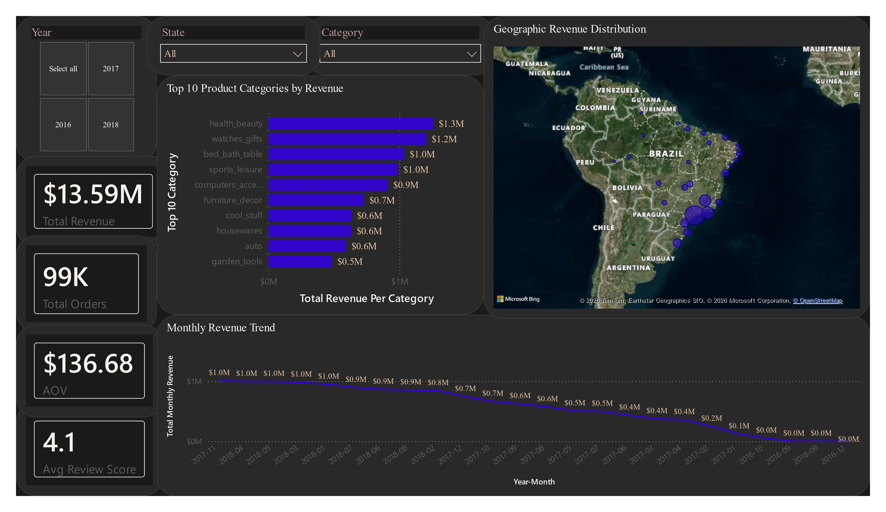
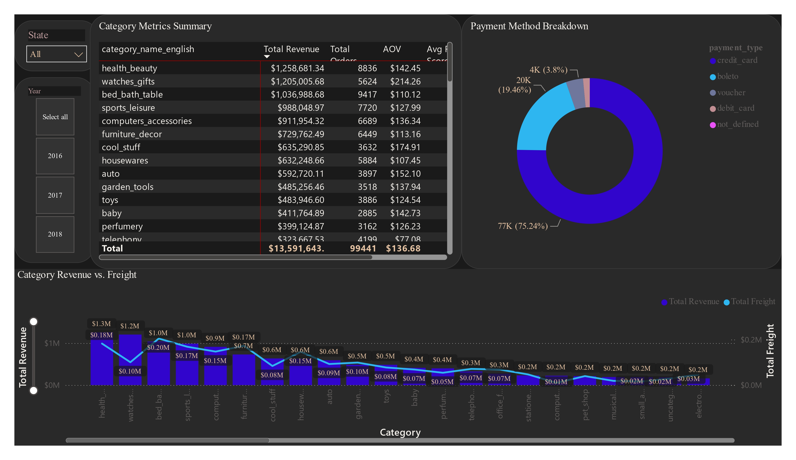
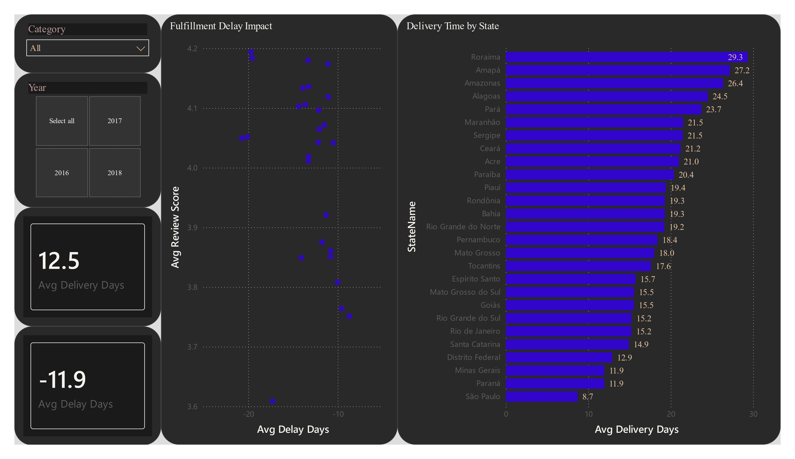
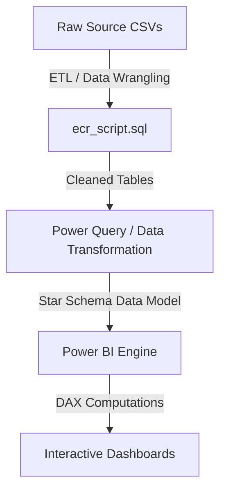

# E-Commerce-Performance-Monitoring

---

## 📊 E-Commerce Performance & Regional Logistics Dashboard

---


An end-to-end e-commerce business intelligence suite built in Power BI using the Brazilian Olist E-Commerce Public Dataset. This interactive dashboard transforms over 100K raw order transactions (2016–2018) into actionable insights across revenue growth, product category performance, payment preferences, and regional delivery logistics bottlenecks.

---

## 📄 Dashboard PDF Report (Live View Alternative)

Since live Power BI Web publishing requires organizational tenant licensing, a high-resolution export is available for offline inspection:

* 📄 **[Download / View `ecr_dashboard.pdf`](./ecr_dashboard.pdf)** — Full multi-page interactive static view.

---

## 🖼️ Executive Dashboards Preview

### 1. Executive Overview
Focuses on macro-level financial KPIs, revenue trajectory over time, geographical revenue concentration across Brazilian states, and top-performing categories.



### 2. Product & Category Analysis
Deep-dives into category-level unit sales, product price points, payment method distributions, and freight-to-revenue ratios.



### 3. Regional & Logistics Insights
Analyzes logistics operational performance, comparing actual vs. estimated delivery timelines by state and examining the impact of shipping delays on review scores.



---

## 💡 Key Business Insights

* **Macro Performance:** The platform processed **$13.59M** in Total Revenue across **99K** completed orders, maintaining an average order value (AOV) of **$136.68** and an overall customer satisfaction score of **4.1 / 5.0**.
* **Payment Preference:** Credit cards account for **75.24%** of all transactions ($77K orders$), followed by *Boleto* (voucher slip) at **19.46%** ($20K orders$).
* **Logistics Disparities:** Deliveries to remote northern states (e.g., **Roraima** at ~29.3 days, **Amapá** at ~27.2 days) take more than triple the fulfillment time required for southeastern hubs like **São Paulo** (8.7 days).
* **Fulfillment Buffer:** On average, actual delivery occurred **11.9 days ahead** of the estimated delivery date promised to customers, preserving high review scores despite regional distance bottlenecks.

---

## 📂 Repository File Structure

```text
ECR_Dashboard/
│
├── 📁 Source/                            # Raw transactional CSV datasets
│   ├── olist_customers_dataset.csv
│   ├── olist_geolocation_dataset.csv
│   ├── olist_order_items_dataset.csv
│   ├── olist_order_payments_dataset.csv
│   ├── olist_order_reviews_dataset.csv
│   ├── olist_orders_dataset.csv
│   ├── olist_products_dataset.csv
│   ├── olist_sellers_dataset.csv
│   └── product_category_name_translation.csv
│
├── 📜 ecr_script.sql                     # SQL data cleaning, pipeline & transformation queries
├── 📊 ecr_dashboard.pbix                 # Core Power BI dashboard file
├── 📈 ecr_dashboard.xlsx                 # Data validation and preliminary analysis workbook
│
├── 📑 delivery_performance.csv           # Exported analytical extract for logistics
├── 📑 item_price_freight_extract.csv     # Exported extract for pricing & freight analysis
├── 📑 monthly_revenue_metrics.csv        # Summary metrics extract for revenue timeline
├── 📑 product_performance.csv            # Summary metrics extract for category performance
│
├── 📄 ecr_dashboard.pdf                  # Complete dashboard PDF preview export
├── 🖼️ 01_Executive_Overview.png          # High-res preview - Page 1
├── 🖼️ 02_Product_Category_Analysis.png   # High-res preview - Page 2
└── 🖼️ 03_Regional_Logistics_Insights.png  # High-res preview - Page 3
```

---

## 🛠️ Data Architecture & Pipeline



### Data Modeling (Star Schema)
* **Fact Tables:** `ecr_db orders`, `ecr_db order_items`, `ecr_db order_payments`, `ecr_db order_reviews`
* **Dimension Tables:** `Dim_Date`, `Dim_State`, `ecr_db customers`, `ecr_db products`, `ecr_db sellers`
* **Relationships:** $1:\text{Many}$ relationships with single-direction filtering to optimize engine execution speed.

---

## 🧮 Core DAX Measures Formula Reference

$$\text{AOV} = \frac{\text{Total Revenue}}{\text{Total Orders}}$$

```dax
// Financial & Volume Measures
Total Revenue = SUM(ecr_db_order_items[price])

Total Orders = DISTINCTCOUNT(ecr_db_orders[order_id])

AOV = DIVIDE([Total Revenue], [Total Orders], 0)

Total Freight = SUM(ecr_db_order_items[freight_value])

// Logistics & Satisfaction Measures
Avg Review Score = AVERAGE(ecr_db_order_reviews[review_score])

Avg Delivery Days = 
AVERAGEX(
    ecr_db_orders,
    DATEDIFF(ecr_db_orders[order_purchase_timestamp], ecr_db_orders[order_delivered_customer_date], DAY)
)

Avg Delay Days = 
AVERAGEX(
    ecr_db_orders,
    DATEDIFF(ecr_db_orders[order_estimated_delivery_date], ecr_db_orders[order_delivered_customer_date], DAY)
)
```

---

## 🚀 How to Run & View Locally

1. **Clone or download** this repository locally.
```bash
git clone https://github.com/Devendra-Bahadur-Singh/E-Commerce-Performance-Monitoring.git
cd E-Commerce-Performance-Monitoring
```
2. Ensure **Microsoft Power BI Desktop** (latest version) is installed.
3. Open `ecr_dashboard.pbix` to explore interactively with full cross-filtering and drill-down capabilities.
4. If modifying source data, run `ecr_script.sql` on your local SQL environment and point the Power Query connectors to your dataset path.

---

## 🛠️ Tools & Technologies Used

* **Business Intelligence:** Power BI Desktop (Power Query, DAX, Custom Themes, Dark Canvas Styling)
* **Database & Querying:** Microsoft SQL Server / T-SQL (`ecr_script.sql`)
* **Data Prep & Audit:** Microsoft Excel
* **Data Modeling:** Star Schema Dimensional Modeling

---

## 👤 Author

**Devendra Bahadur Singh**  
Github: [@devendra.bahadur.singh](https://github.com/Devendra-Bahadur-Singh)
Linkedin: [@devendra.bahadur.singh](https://www.linkedin.com/in/devendra-bahadur-singh-31133a3a8)